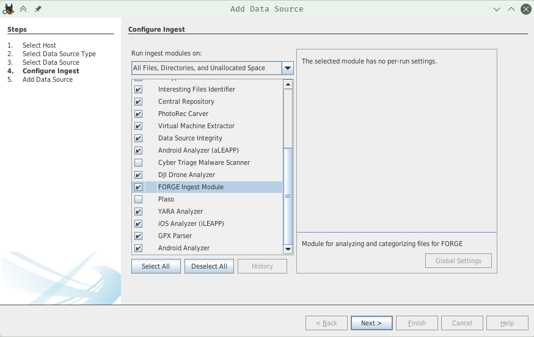
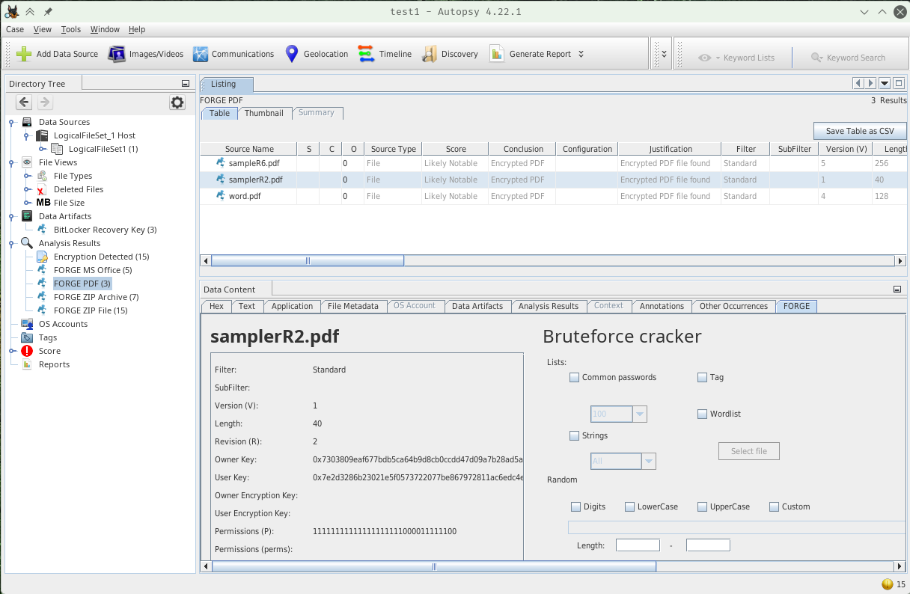
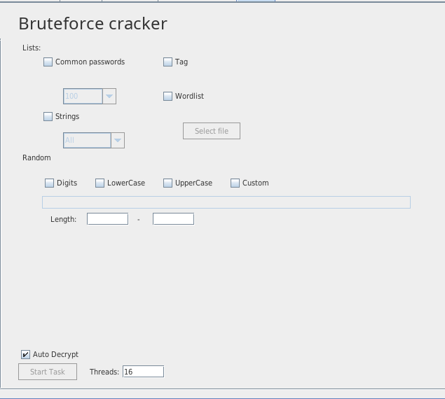

# FORGE

Forensic Operations for Recovering Guarded Evidence (FORGE) is an Autopsy module that detects encrypted files and volumes within a case, extracts relevant metadata, and attempts to recover encrypted content using candidate passwords and wordlists.

## Supported formats
- ZIP
- Microsoft Office (OOXML)
- PDF
- BitLocker
- LUKS
- Extraction of BitLocker encryption keys from text files, PDFs, and MS Office files

## Features
- Detects encrypted files and volumes in a case
- Extracts metadata (for example: non-encrypted headers, detected algorithms, and other relevant attributes)
- Attempts decryption using candidate passwords obtained from:
  - Provided wordlists
  - Custom wordlists
  - Strings extracted from case artifacts (text files, Office documents, etc.)
  - Optional brute-force attempts (configurable)

## Installation
1. Build from source or grab the latest binary from the Release page
1. Go to Tools → Plugins → Downloaded
1. Click *Add Plugins...*
1. Choose the *.nbm* file
1. Install the plugin
1. Accept the validation warning (signed binaries TBD)

## Usage
The module contains multiple submodules (Autopsy modules), and each submodule provides part of the functionality.

### Ingest module
When you add a new data source, the ingest module will find encrypted files and volumes and extract metadata. There are no settings currently.


After running the module, found encrypted files are tagged with FORGE tags and each file's metadata is displayed.


When working with ZIP files, the internal structure is shown and each file inside the archive has its own extracted metadata.

### Brute-force module
This module is responsible for trying to decrypt files with potential passwords. At this point, password attempts run only on the CPU (multi-threaded), with plans to add GPU acceleration in the future.

Methods of creating passwords to try can be combined. All possible combinations (if enabled) run last. The password attempts run as a background task, so you can continue working while the process runs.

With some formats (e.g., ZIP), false positives can occur: an incorrect password may pass the checking algorithm even though the content is not correctly decrypted. In that case, run the cracker again — it will ignore the wrong password.



#### Common passwords
Public lists of the most common passwords. You can select the number of passwords.

#### Tag
If an analyst manually finds files that potentially contain passwords, they can tag the file with the pre-created tag *FORGE Cracker source*.

#### Wordlist
A custom wordlist can be used. Format: plain text file, one password per line.

#### Strings
Uses extracted strings from other files (plain text, PDF, MS Office) within the same folder, data source, hostname, or case.

#### Random
Uses all possible password combinations generated according to specified rules.

## Building from source
1. Clone the repository:  
    ```bash
    $ git clone https://github.com/memthw/forge
    ```
1. Open the project in NetBeans (netbeans.apache.org)
1. Right-click the project → Preferences → Libraries
1. Add the Autopsy platform by clicking *Manage Platform*
1. Locate the Autopsy platform (location depends on your OS). More information in the [Autopsy Documentation](https://www.sleuthkit.org/autopsy/docs/api-docs/3.1/mod_dev_page.html)
1. Run the module directly from NetBeans, or right-click the project → Create NBM and import the file into Autopsy

## API Docs
API docs are build using Javadoc system and published [here](https://memthw.github.io/forge/)

## Future plans
- Implement GPU-accelerated cracker
- Use known vulnerabilities in file formats to decrypt files faster
- Better support for BitLocker and LUKS volumes
- Rebuild the UI for better UX

### Disclaimer


This software was developed with the support of the **Faculty of Information Technology, Czech Technical University in Prague** as part of a [Master’s thesis](https://dspace.cvut.cz/handle/10467/122659) (in Czech).

For more information, visit [fit.cvut.cz](https://fit.cvut.cz).